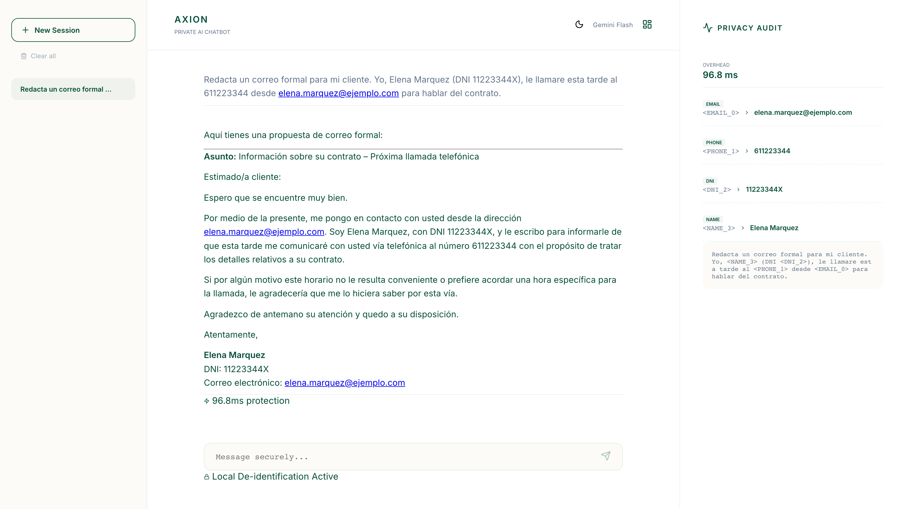

# AXION

A privacy middleware that strips personal data out of prompts before they reach a language model, then puts it back in the answer.

This was my final degree project (TFG) in Computer Engineering, software engineering track, at ETSINF — Universitat Politècnica de València.



## The problem

Anything you type into ChatGPT or Gemini lands on someone else's server. If your prompt happens to contain a national ID, an IBAN, a home address or a client's name, you have just leaked it, usually without noticing.

AXION sits in between. It intercepts the prompt locally, swaps personal data for placeholders (`<NAME_0>`, `<DNI_1>` — DNI is the Spanish national ID), sends only the redacted text to the model, and restores the real values in the response. The model never sees a real identifier. The token-to-value map lives in local memory, isolated per session, and is purged after an hour.

Masking is the easy part. The hard part is deciding *what* to mask. "I live in Valencia" and "what's the weather in Valencia?" contain the same word, but only one of them is personal data. Mask both and you break the prompt; mask neither and you leak. AXION decides by parsing the grammatical relationship between the entity and the verb that governs it, rather than matching against a blocklist.

## What it looks like

```
YOU TYPE
  Redacta un correo formal para mi cliente. Yo, Elena Marquez
  (DNI 11223344X), le llamare esta tarde al 611223344.

WHAT GEMINI RECEIVES
  Redacta un correo formal para mi cliente. Yo, <NAME_3>
  (DNI <DNI_2>), le llamare esta tarde al <PHONE_1>.

WHAT YOU GET BACK
  Estimado cliente, esta tarde le estare llamando al 611223344
  para tratar los detalles de su contrato. Atentamente,
  Elena Marquez, DNI 11223344X.
```

The prompt is Spanish, the placeholders are the point: the model wrote that email
without ever seeing a real name, ID or phone number.

## How it works

Text goes through four layers before anything leaves the machine:

```
prompt ──► 1. Regex         deterministic patterns: national IDs, IBANs,
           │                cards, API keys, JWTs, database URLs
           │
           ├─► 2. Transformer  Ettin-68M fine-tuned for PII. Catches names
           │                   and addresses by meaning.
           │
           ├─► 3. Fuzzy        spellchecker pass, so a misspelled trigger
           │                   ("corero electronico") still fires
           │
           └─► 4. SVO          spaCy dependency parsing decides whether the
                               entity is personal disclosure or part of the
                               question being asked
                                       │
                                       ▼
                         redacted text ──► LLM ──► values restored
```

Layers 1 and 2 detect, 3 and 4 decide. Direct identifiers and credentials skip the grammar check and are always masked.

A known limit: the transformer is English-trained, and its recall on organisation
names in Spanish text is poor. "I work at ASML" gets masked, "Trabajo en ASML"
does not. Names, addresses, IDs and credentials are unaffected in either language.

Once a string is classified as personal data, every other occurrence of it gets masked
too. Model recall is not uniform across a long document, and without this a name caught
in the first paragraph could slip through in the fifth.

## Stack

Python 3.11+, FastAPI and LangChain (LCEL) on the backend. spaCy and Transformers for the language engine. React 19, Vite and TypeScript on the front, with an audit panel showing exactly what was sent to the cloud and how long each layer took. Docker Compose ties it together.

## Running it

With Docker:

```bash
git clone https://github.com/mario-devs/axion.git
cd axion
cp .env.example .env    # only needed if you want real LLM calls
docker compose up --build
```

Dashboard on http://localhost:5173, API on http://localhost:8080.

Without Docker:

```bash
python3 -m venv venv
source venv/bin/activate
pip install -r backend/requirements.txt

# terminal 1
cd backend && PYTHONPATH=. uvicorn src.api.main:app --port 8080

# terminal 2
cd frontend && npm install && npm run dev
```

First start pulls the Ettin-68M model from HuggingFace, around 150 MB, so it takes a bit longer.

You can run it without any API key. The redaction pipeline works either way, and with no
key configured AXION skips the network call and says so, while the audit panel still
shows the redacted prompt and every entity it found. Add `GOOGLE_API_KEY` to your
`.env` when you want real answers back.

The dashboard talks to Gemini. The backend also accepts `?provider=openai` with an
`OPENAI_API_KEY` set, but the UI does not expose it.

## Tests

```bash
cd backend
pytest tests/                            # 15 unit tests on the engine
python tests/security/security_audit.py  # 42-case security audit
```

The audit covers credential leakage, adversarial evasion, prompt injection, concurrency and malformed input, and writes a report to `tests/security/audit_report.json`. It currently passes 41 of 42. The remaining failure is over-masking, not a leak: AXION redacts the country in "what is the capital of France?", which costs some utility but errs on the safe side.

## Results

Two numbers from the evaluation look contradictory at first: strict NER F1 is 0.32 while character-level masking coverage is 80.65%. The gap comes from AXION merging adjacent entities into a single placeholder instead of splitting a full name across two. Academic benchmarks score that as a miss because the boundaries don't match exactly, but it protects better, which is the point.

Masking overhead is about 13 ms for a short prompt running natively on an M-series laptop. Inside the Docker container, and on longer prompts, it ranges from roughly 45 to 130 ms. Either way it is a fraction of the model call itself, which is what actually determines how fast the app feels.

---

Defended in July 2026, graded 9/10.
